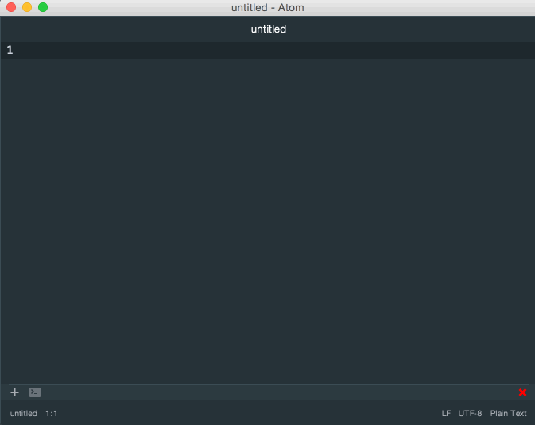

Download and install Atom. Atom is a an open-source text editor maintained by Github, that we will use to write code.

[https://atom.io/](https://atom.io/)

# Atom General Settings

There's long been a religious war between proponents of tabs and spaces in source code. It's a particularly important topic in Python programming, because white space is actually part of the syntax. The Python Style Guide, known as [PEP8](https://www.python.org/dev/peps/pep-0008/) says that Python code should use only spaces, cannot mix spaces and tabs, and that code blocks should be indented by 4 spaces each.

To make sure we don't mess this up, let's have Atom help us out by emitting 4 spaces when pressing the tab key.

1. Go to Atom Preferences & Settings Tab
1. Find the Soft Tabs option.
1. Make sure it's checked.

	

1. Then scroll down and make sure tabs emit 4 spaces:

	

# Embedded Terminal Window Package

Let's install a new package to our Atom instance to make it work better for us.

First we're going to get an embedded terminal in our Atom instance.

1. In Atom hit `command` + `shift` + `p` and type "install package" and hit "enter". Now you are on the Install Packages settings page of Atom.

1. In the search bar type and install this package:

	```
	platformio-ide-terminal
	```

1. To turn this terminal on and off hit `control` + `~`.

	

# Column Select (Many Cursors!)

Atom already lets you use multiple cursors at the same time.

1. Open a new file and type a Bart Simpson classic.

	```
	There is no such month as Rocktober
	There is no such month as Rocktober
	There is no such month as Rocktober
	There is no such month as Rocktober
	```

1. Now `command` + `click` anywhere on the text. You'll see you can make many cursors and make edits.

1. Now click on any of the "Rocktober's" and hit `command` + `D`. You can select and edit multiple instances.

1. To select and edit all the instances, put your cursor on "Rocktober" and hit `command` + `ctrl` + `G`.

But what about clicking and dragging many cursors? Let's install a package for that.

1. Go back to the install settings page and type in this package and install it.

	```
	sublime-style-column-selection
	```

1. Now go back to your Bart Simpson phrases and hold `alt` and drag down the right side. of the text. Huzzah! Many cursors.

# Atom Python Packages

*These instructions are derived from [this blog post](http://www.marinamele.com/install-and-configure-atom-editor-for-python)*.

We're going to install some packages for Atom that makes writing Python much faster by providing real-time validation of your code. In general, these programs are called *linters*.

First we'll use the Atom Package Manager to install `linter`. Linter provides a single api that all the language-specific linters can use to interact with Atom.

	$ apm install linter

*If that didn't work and you see an error like `-bash: apm: command not found`, you need to install `apm` as a shell command accessible from the Terminal. In the menu, go to Atom --> Install Shell Commands and try again.*

Next we'll install the Python linting package, which is called `flake8`. There are two components - one which is a Python package, which takes the actual Python text and checks it with the compiler. We'll install that now.

	$ pip3 install flake8
	$ pip3 install flake8-docstrings

The other component is the Atom package that acts as the glue between `flake8` and `linter` to provide Atom with the real time validation.

	$ apm install linter-flake8

Finally, we have to make some changes to Atom. First we'll change the init script that runs every time Atom is opened.

In the menu, go to Atom --> Open Your Init Script.


Add the following line at the bottom:

	process.env.PATH = ['/usr/local/bin/', process.env.PATH].join(':')

Save that file.

Next we need to change a setting in the `linter-flake8` package. Go to the Atom Preferences page from the Atom menu. Click the packages menu item.


Find the `linter-flake8` package and click the settings button.

*NOTE: If you don't see a settings button, try restarting Atom. Also ensure that you installed Atom into your Applications directory and that you're running that Atom.*


Find the executable path setting:


To figure out where the `flake8` executable is located in our filesystem, we can use the `which` command. Go to the terminal and type:

	$ which flake8

Take the result of that command, and paste it into the exectuable path setting in Atom.

> [info]
>
In my case, `flake8` was here:
>
	/Library/Frameworks/Python.framework/Versions/3.5/bin/flake8
