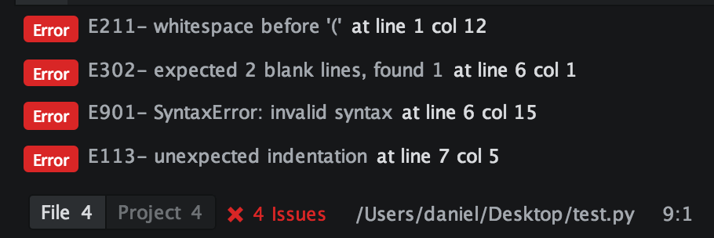

Everyone will be using Python for all your Computer Science courses, so we'll take this time to set the language up on your computer.

# Homebrew

Homebrew is a package manager for Mac OS. It makes it easy to install software packages while also installing and managing their dependencies. For more information, see the [Homebrew website](http://brew.sh/)

To install Homebrew, run this terminal command, which will download and run an install script:

```bash
$ ruby -e "$(curl -fsSL https://raw.githubusercontent.com/Homebrew/install/master/install)"
```

If you already have Homebrew installed, you need to update your formulae by running:

```bash
$ brew update
```

This may take several minutes to download updates, so be patient while it completes.

# Python Environment

Make sure you install the iOS environment first - the instructions assume you have, because you will need Command Line Tools and Homebrew installed already.

## Python 3

OS X comes with a version of Python (2.7) installed by default. We can call that the *system Python*. But that version is old! Python 3 was released in 2008, and it came with a bunch of syntax changes that were incompatible with 2.x versions of Python. This created a fork in the language, as many large Python projects (including many helpful libraries) didn't want to invest the time to convert to 3.x.  But that was then; it's now recommended that all new Python projects are made in Python 3.x. For more information, see [this article](https://wiki.python.org/moin/Python2orPython3).

So we're going to install the newest Python.

*These instructions are derived from [this great post](http://www.marinamele.com/2014/07/install-python3-on-mac-os-x-and-use-virtualenv-and-virtualenvwrapper.html)*.

Use Homebrew to install Python 3 and its dependencies:

	$ brew install python3

Once that's finished, you should be able to see which version of Python is installed like this:

	$ python3 --version

That will also install the Python package manager, called `pip`, which can be used to download Python libraries. Because we're using Python 3, you should always use `pip3`, which is the Python 3 version.

## Virtualenv

By default, `pip` and `pip3` install packages into a directory used by Python system-wide. This can create problems, because different Python projects might be dependent on different versions of libraries. Upgrading a library on one project might break all of your other projects, which is a nightmare.

`virtualenv` is the solution to this problem. Here's the [official documentation](https://virtualenv.pypa.io/en/latest/), but the TL;DR is that for each project it creates a virtual environment in which packages are installed, and ensures that the project is not dependent on any packages outside the virtual environment.

To install `virtualenv`, use the following command

	$ pip3 install virtualenv

As you create each Python project, you will also want to create an associated virtual environment in which you can install packages.

## Testing It Out

Now we can test our environment. Restart Atom. Then create a new file and save it as `test.py`. Or *anything*`.py` really, but make sure the filename has the `.py` extension so that Atom knows that it's Python source code.

Try testing some gibberish in the editor - you should see the linter issues appear at the bottom:


